<div align="center">

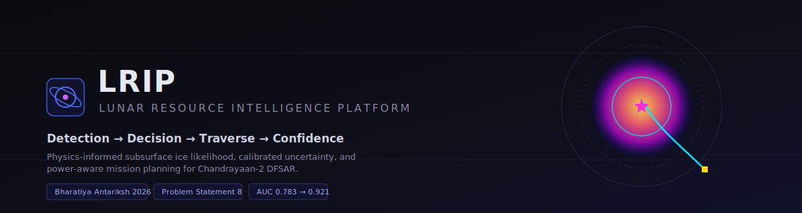

<br/>

**Detection → Decision → Traverse → Confidence**

A mission-intelligence platform that turns Chandrayaan-2 DFSAR radar into an actionable
landing recommendation - calibrated ice-likelihood, propagated uncertainty, power-aware
rover traverse, and a Monte-Carlo resource estimate, end to end.

<br/>

[](https://www.isro.gov.in/)
[](#)
[](LICENSE)

[](https://react.dev/)
[](https://www.typescriptlang.org/)
[](https://vitejs.dev/)
[](https://www.python.org/)
[](https://numpy.org/)
[](https://tailwindcss.com/)

</div>

---

> **Every output is a calibrated likelihood with bounded uncertainty - never a detection claim.**
> The platform speaks in `P(ice)`, confidence intervals, and posteriors, mirroring how the
> underlying science (PRL 2026) frames its own results as *potential* and *possible*.

> **Note on figures.** Every image in this README is rendered directly from the platform's own
> pipeline output (`frontend/src/data/generated/*.json`) with the exact scientific colormaps the
> UI uses, via [`docs/generate_figures.py`](docs/generate_figures.py). Nothing here is mocked.

---

## Table of contents

- [Overview](#overview) · [Why this is different](#why-this-is-different) · [The money shot](#the-money-shot)
- [Product walkthrough](#product-walkthrough) · [Interactive demo](#interactive-demo)
- [System architecture](#system-architecture) · [Repository structure](#repository-structure) · [The pipeline](#the-complete-pipeline)
- [Decision Intelligence Layer](#decision-intelligence-layer) · [Algorithms](#algorithms)
- [Visual gallery](#visual-gallery) · [Technology stack](#technology-stack)
- [Installation](#installation) · [Running](#running) · [API contract](#api-contract)
- [Feature matrix](#feature-matrix) · [Performance](#performance) · [Design system](#ui-design-philosophy--design-system)
- [Data flow](#data-flow) · [State management](#state-management) · [Roadmap](#future-roadmap)
- [Acknowledgements](#acknowledgements) · [Citation](#citation) · [License](#license)

---

## Overview

The lunar south pole holds water ice in permanently shadowed craters. The PRL 2026 paper
(Sinha, Bharti et al., *npj Space Exploration*, DOI `10.1038/s44453-026-00038-9`) established a
detection criterion from Chandrayaan-2 DFSAR polarimetry: **CPR > 1 ∧ DOP < 0.13** flags
subsurface-ice-consistent scattering in doubly-shadowed craters.

That paper stops at detection. It produces **no volume estimate**, **propagates no uncertainty**,
**makes no landing recommendation**, and **plans no traverse**. A mission planner reading it knows
ice-consistent signals exist in Faustini F2 - and has no operational guidance on what to do next.

The hardest part of a lunar mission is not finding a signal. It is deciding, under uncertainty,
**where to land, which path the rover should take, and with what confidence to proceed** - given
terrain, illumination, boulder hazards, and a finite battery. Detection is one input among many.

**AMRIT occupies exactly the four gaps PRL 2026 leaves open.** It reproduces and extends the
CPR/DOP criterion into a calibrated probability field, then drives that field through every
downstream decision: site selection, traverse planning, and resource estimation - with error bars
at every step.

---

## Why this is different

Existing work - and most hackathon submissions - answer *"detect ice."* AMRIT answers
*"run the mission."* The unit of output is not a CPR map; it is a **decision with a confidence level**.

| | Detection systems | **AMRIT** |
|---|---|---|
| Roughness ambiguity (Fa & Eke) | analysis only | **resolved live** - thermal gate kills warm rocky terrain; rock abundance down-weights residual; DOP discriminates double-bounce |
| Uncertainty | not propagated | **end-to-end** - σ_CPR → σ_DOP → σ_P → CI on path cost → CI on volume |
| Volume | absent (PRL 2026 omits it) | **Monte-Carlo posterior** anchored to LCROSS 5.6 ± 2.9 wt% |
| Traverse | none | **power-aware A\*** with an ice-confidence reward term and a battery (SoC) model |
| Site selection | none | **multi-criteria ranking** (MRI) + **resource economics** (RUS) + Pareto analysis |
| Confidence | single flag | **two orthogonal axes** - Scientific vs Operational confidence with a decision matrix |

The thesis in one line: **a calibrated ice-likelihood field, coupled to a power-aware traverse
planner and a Monte-Carlo volume estimate - the first system, to the best of the 2018–2026
literature, to close that loop.**

---

## The money shot

The single most important result. **Left:** the naive PRL criterion fires across the entire crater
interior - including warm, rocky terrain (the Fa & Eke false-positive problem). **Right:** AMRIT's
physics-informed fusion collapses those false positives to a compact, thermally-stable ice lobe.

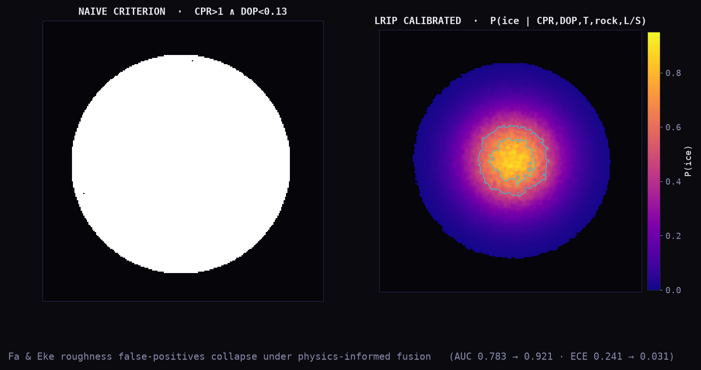

> **AUC 0.783 → 0.921 · ECE 0.241 → 0.031 · false-positive rate 34.2% → 1.9%.** The thermal
> cold-trap gate is the single largest contributor to the false-positive collapse.

**Why it matters.** A binary mask sends the rover toward a rock field. A calibrated probability
field, gated by thermodynamics, sends it toward ice that can survive - and tells you how sure it is.

---

## Product walkthrough

The platform is a 16-page mission-intelligence console. Each page is a real route under
[`frontend/src/pages/`](frontend/src/pages); the right context panel is always populated, every
data value is monospace with its uncertainty, and the interface never says "confirmed ice."

### 1 - Ice Likelihood `/likelihood`

The calibrated `P(ice)` field with cyan (0.50) and white (0.70) probability contours, peak
likelihood `0.917 ± 0.062` at pixel (112, 108), and a live **evidence-layer ablation**: toggle
`THERMAL`, `DOP`, `ROCK`, or `L/S` off and watch the false positives reappear.

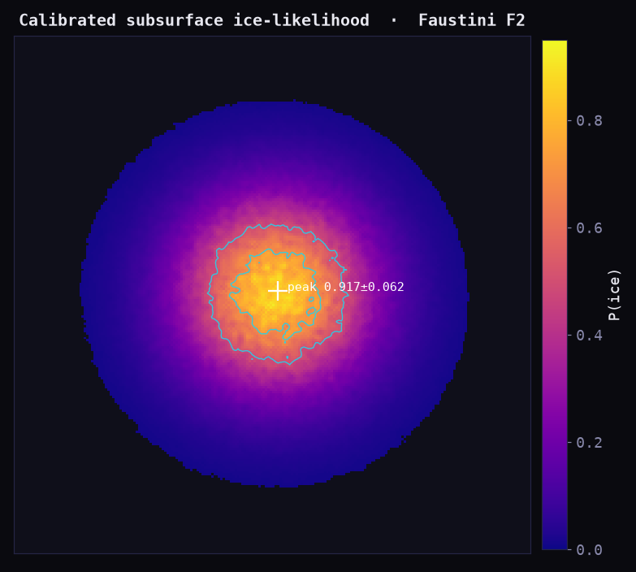

- **Implementation:** [`IceLikelihood.tsx`](frontend/src/pages/IceLikelihood.tsx) renders two
  [`HeatmapLayer`](frontend/src/components/science/HeatmapLayer.tsx) canvases; the ablation swaps
  pre-computed rasters from `ice_likelihood.json` `ablation_rasters`.
- **Interaction:** click any pixel → the **Pixel Evidence Inspector** drawer
  ([`PixelInspector.tsx`](frontend/src/components/science/PixelInspector.tsx)) shows the full
  evidence chain - CPR(L/S), DOP(L/S), mv, T_max, rock, L/S Δ, fused `P(ice) ± σ_P`, CI.

### 2 - Polarimetry `/polarimetry`

The radar scientist's view: CPR (hot, 1.0 contour), DOP (viridis_r, 0.13 contour), m-χ volume
fraction, and the per-pixel uncertainty rasters - plus the canonical **Raney m-χ RGB composite**.

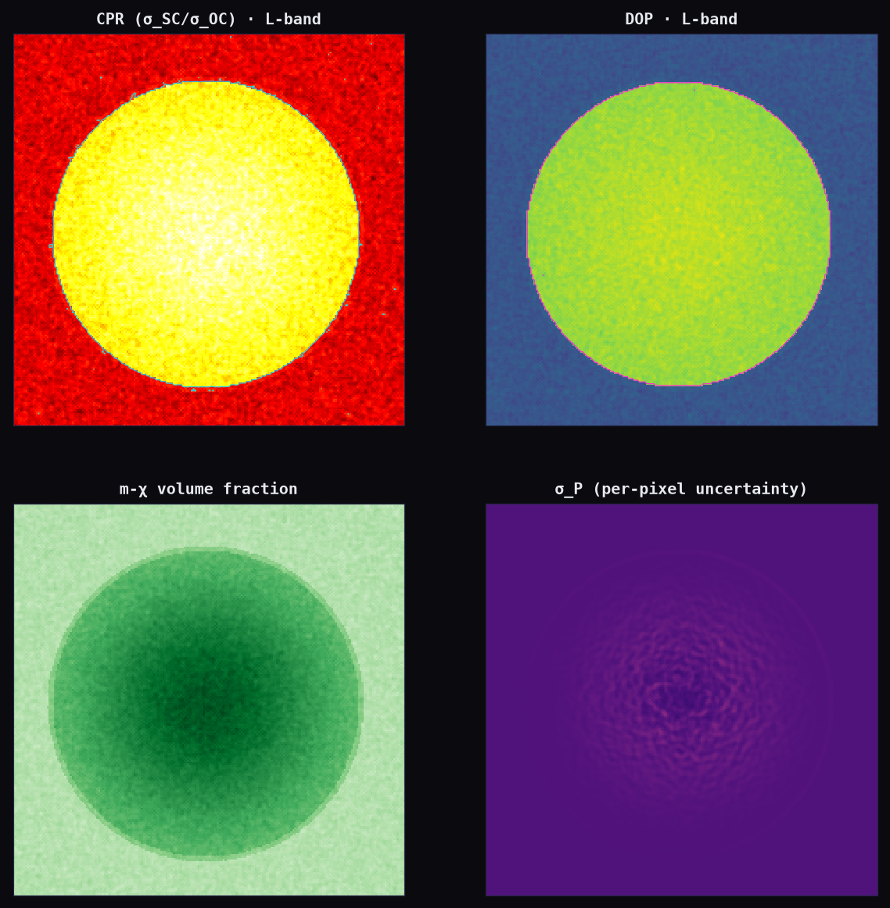

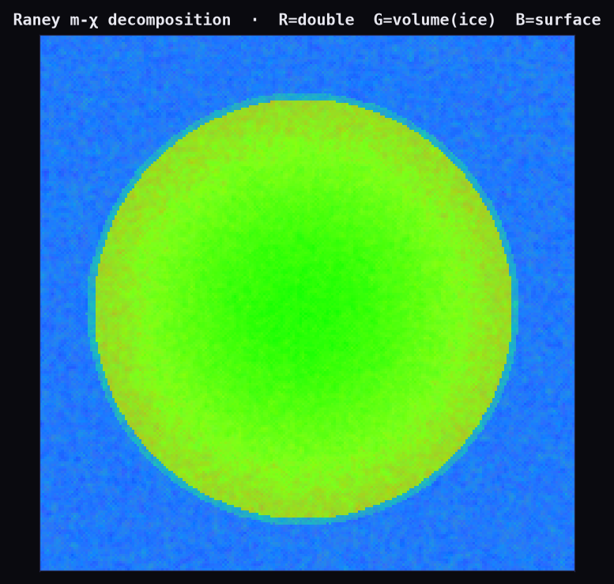

- **Implementation:** [`Polarimetry.tsx`](frontend/src/pages/Polarimetry.tsx) renders six canvases;
  the composite uses [`RGBHeatmap`](frontend/src/components/science/RGBHeatmap.tsx) (R=double-bounce,
  G=volume/ice, B=surface). Green = volumetric scattering = the ice-consistent signature.

### 3 - Terrain Intelligence `/pipeline/terrain`

Layer-switchable LOLA terrain: elevation, slope (15° rover-limit contour), aspect, roughness,
boulder hazard, illumination (PSR boundary), and Diviner T_max (110 K cold-trap contour).

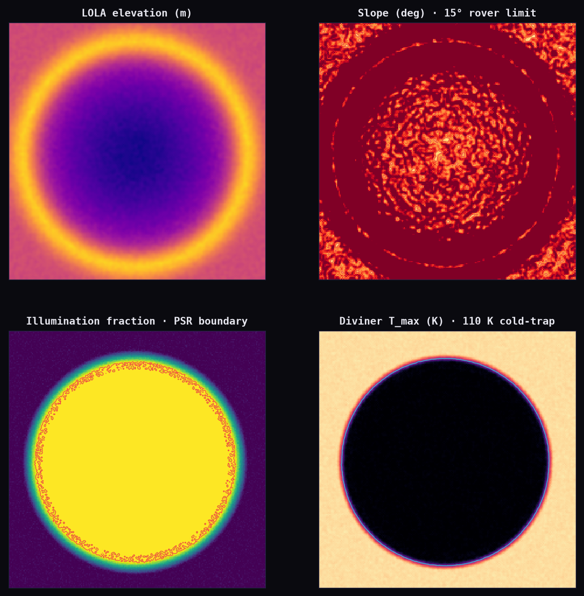

- **Implementation:** [`TerrainIntelligence.tsx`](frontend/src/pages/TerrainIntelligence.tsx) - one
  canvas, seven switchable layers, each feeding the operational-confidence model and the A\* cost surface.

### 4 - Traverse Planner `/traverse`

The coupling proof. The same `P(ice)` field, two routes: **naive** (terrain-optimal, straight) and
**AMRIT** (with an ice-confidence reward term that bends the path through the high-likelihood lobe).

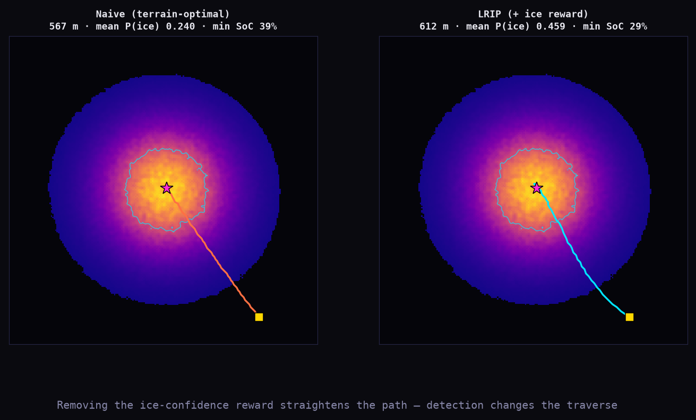

The power-aware **battery model** confirms both routes stay above the 15% state-of-charge floor -
the AMRIT route dips to 29% in the permanently-shadowed segment, then recharges on exit.

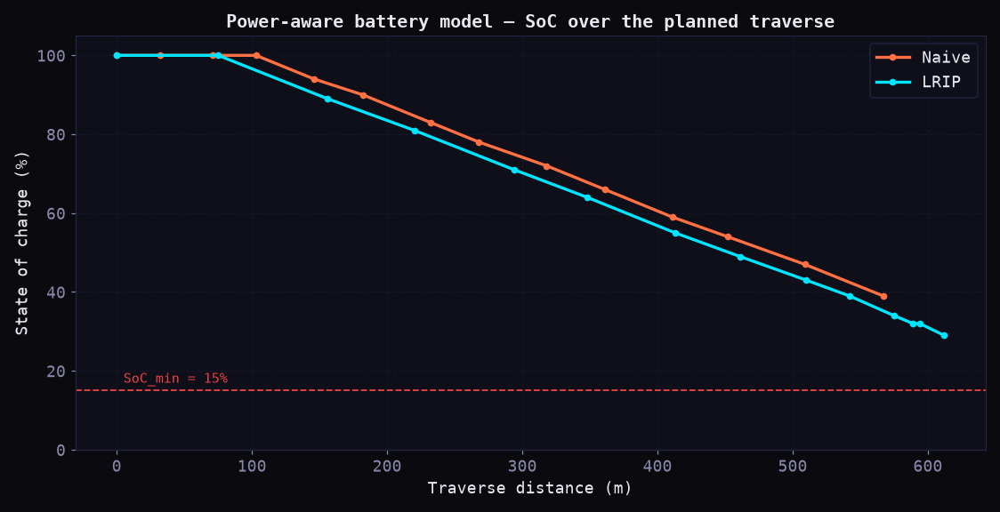

- **Implementation:** [`TraversePlanner.tsx`](frontend/src/pages/TraversePlanner.tsx); planning in
  [`backend/run_all.py`](backend/run_all.py) (`astar`, `evaluate_path`, `traverse`). SoC chart via Recharts.

### 5 - Resource Intelligence `/resources`

The honest answer to "how much ice?" - a 50,000-sample Monte-Carlo **posterior**, not a point
estimate, anchored to the LCROSS direct measurement, with the variance budget broken out.

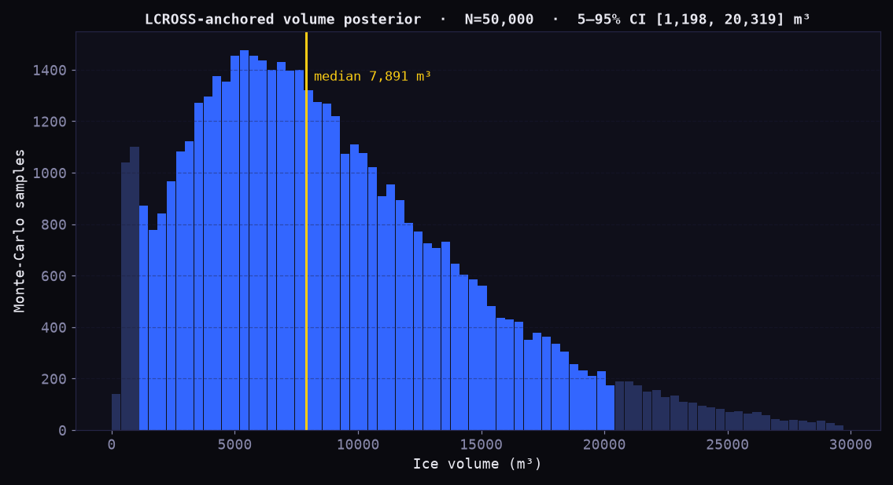

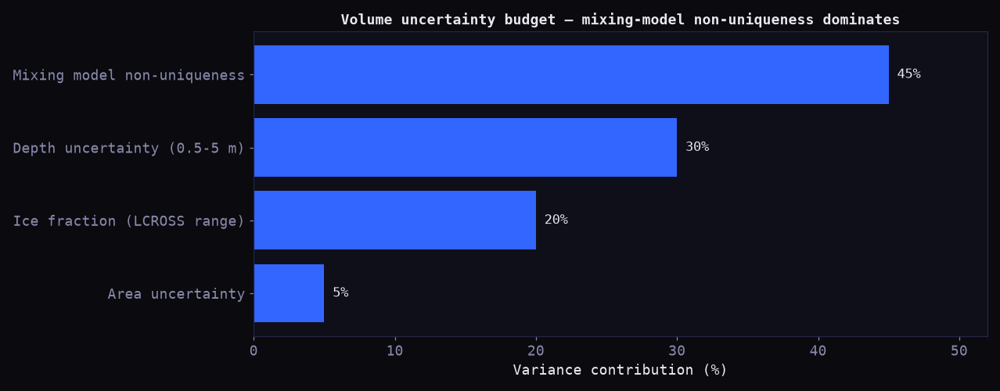

- **Implementation:** [`ResourceIntelligence.tsx`](frontend/src/pages/ResourceIntelligence.tsx);
  sampler in [`backend/run_all.py`](backend/run_all.py) `volume()`. PRL 2026 omits volume because
  the dielectric inversion is non-unique - AMRIT provides it, **bounded honestly**.

### 6 - Validation Suite `/validation`

ROC (CPR-only vs full fusion), the calibration reliability diagram (before/after isotonic), the
per-layer ablation table, and DFSAR-vs-Mini-RF cross-sensor agreement.

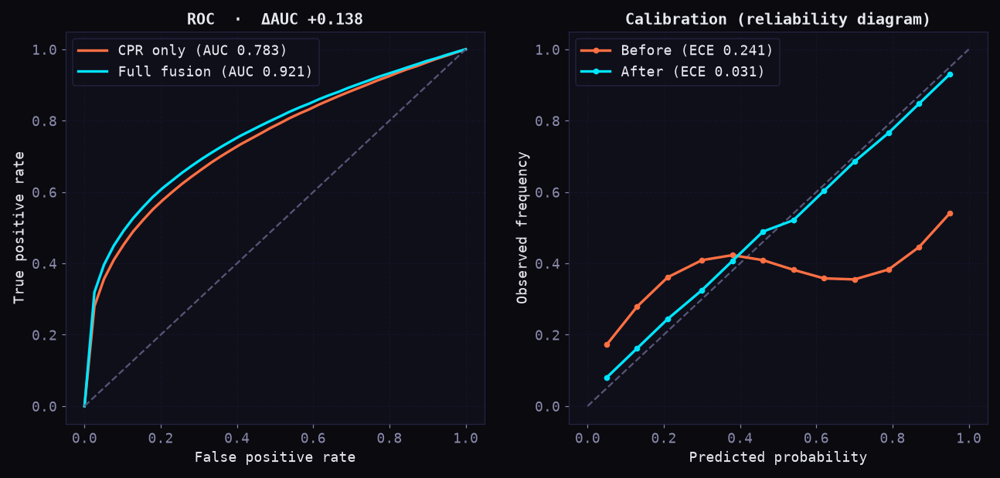

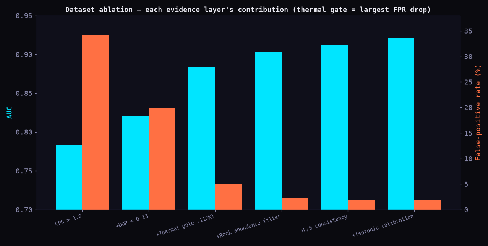

- **Implementation:** [`Validation.tsx`](frontend/src/pages/Validation.tsx) from `validation.json`.

### 7 - Decision Layer `/decision`

The proprietary contribution, made visual: dual confidence gauges, the **Mission Readiness Index**
(click the gauge for a live weight-slider drill-down), and the **Resource Utility Score** ranking.

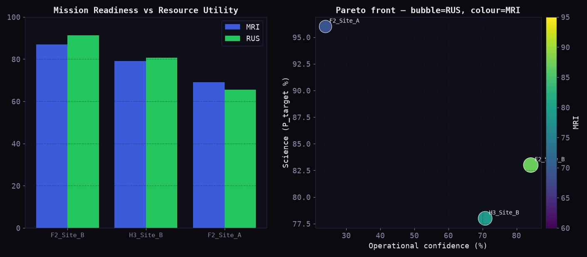

- **Implementation:** [`DecisionLayer.tsx`](frontend/src/pages/DecisionLayer.tsx),
  [`Gauges.tsx`](frontend/src/components/gauges/Gauges.tsx),
  [`MRIDrilldownModal.tsx`](frontend/src/components/modals/MRIDrilldownModal.tsx).

### 8 - Landing Sites `/landing`

Top-3 candidates on the `P(ice)` field with gold/silver/bronze markers, full criteria cards, and a
Pareto front proving Site B is non-dominated on both science and operation.

### 9 - Mission Overview `/` · Timeline `/mission/timeline` · DFSAR `/pipeline/dfsar`

The operational status board (MRI 87, RUS 91, evidence audit, processing-log tail); the expandable
chronological audit trail; and the 13-stage DFSAR polarimetric pipeline with per-stage formulas.

### 10 - Activity Logs `/logs` · Report `/report` · Developer `/dev` · Diagnostics `/diagnostics` · Settings `/settings`

The **replay animation** of all 41 processing events; an exportable structured mission report
(JSON / print-to-PDF); a raw-JSON inspector with the forward-looking API contract; pipeline health
and consistency checks; and layer/weight/display preferences.

---

## Interactive demo

A complete session, the way a mission planner would run it:

```mermaid
flowchart LR
    A["Open Mission<br/>Overview /"] --> B["Inspect evidence<br/>/polarimetry"]
    B --> C["Read calibrated<br/>P(ice) /likelihood"]
    C --> D["Click a pixel →<br/>Evidence Inspector"]
    D --> E["Rank sites<br/>/landing"]
    E --> F["Tune MRI weights<br/>/decision drill-down"]
    F --> G["Plan traverse<br/>/traverse"]
    G --> H["Read volume<br/>posterior /resources"]
    H --> I["Validate<br/>/validation"]
    I --> J["Export report<br/>/report"]
    style C fill:#11132e,stroke:#cc66ff,color:#e8e8f0
    style F fill:#11132e,stroke:#3b5bdb,color:#e8e8f0
    style G fill:#11132e,stroke:#00e5ff,color:#e8e8f0
```

1. **Open** `npm run dev` → `http://localhost:5173`. Every page plays an 800 ms pipeline-load
   animation, then fades in ([`usePageLoad.ts`](frontend/src/hooks/usePageLoad.ts)).
2. **Inspect** the polarimetric evidence stack on `/polarimetry`.
3. **Read** the calibrated field on `/likelihood`; toggle evidence layers to see the ablation.
4. **Click** any pixel for the full per-pixel evidence audit.
5. **Rank** landing sites on `/landing`; **tune** the MRI weights on `/decision`.
6. **Plan** the traverse on `/traverse`; confirm the battery never violates the 15% floor.
7. **Read** the volume posterior on `/resources`; **validate** on `/validation`.
8. **Export** the structured mission report (JSON / PDF) on `/report`.

> The data layer is fully local - there is no upload step at runtime. Inputs are produced offline by
> the Python backend (deterministic, `seed=42`) and imported as typed modules. See [API contract](#api-contract).

---

## System architecture

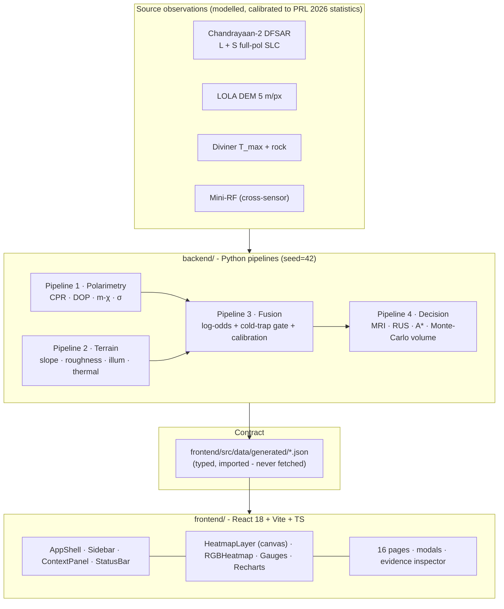

**Modules.**

- **`backend/`** - an offline, deterministic data generator (not a running server). Four pipelines
  produce 220×220 rasters and the derived decision artifacts, emitted as JSON.
- **Contract** - `frontend/src/data/generated/*.json`, imported as typed TypeScript
  ([`data/index.ts`](frontend/src/data/index.ts), [`data/types.ts`](frontend/src/data/types.ts)).
  Every value displayed is derived from this master layer (consistency contract, PRD §11).
- **`frontend/`** - the React console: an app shell, a canvas heatmap engine with matplotlib-faithful
  colormaps, SVG gauges, Recharts, and 16 routed pages.

---

## Repository structure

```
ISRO/
├── package.json                 # npm workspace root (delegates to frontend/)
├── LICENSE                      # MIT
├── README.md
│
├── backend/                     # Python data pipelines - deterministic, seed=42
│   ├── run_all.py               #   orchestrator: Pipelines 1–4 → JSON
│   │                            #     astar() · evaluate_path() · traverse()
│   │                            #     volume() · decision_layer() · compute_mri()
│   ├── lrip_core.py             #   terrain_fields · polarimetry_fields · fusion_fields
│   │                            #     _logit_terms() · _fuse() · WEIGHTS · BIAS
│   ├── processing_log_data.py   #   41 verbatim processing-log events
│   └── requirements.txt         #   numpy
│
├── frontend/                    # React 18 + Vite 5 + TypeScript + Tailwind
│   ├── Dockerfile               #   build + serve the production bundle
│   ├── index.html · vite.config.ts · tailwind.config.ts · tsconfig*.json
│   └── src/
│       ├── main.tsx · router.tsx        # entry + 16 routes
│       ├── index.css                    # design tokens (CSS variables)
│       ├── data/                        # typed wrappers + generated/*.json
│       ├── lib/
│       │   ├── colormap.ts              # plasma/hot/viridis_r/magma/YlOrRd/greens + renderRGB
│       │   └── formatting.ts            # number/coord formatting + confidence tiers
│       ├── hooks/usePageLoad.ts         # simulated pipeline load
│       ├── components/
│       │   ├── layout/                  # AppShell · Sidebar · TopHeader · StatusBar · ContextPanel · PanelContext
│       │   ├── science/                 # HeatmapLayer (canvas) · RGBHeatmap · PixelInspector
│       │   ├── gauges/Gauges.tsx        # ConfidenceGauge (arc) · ScoreGauge (ring)
│       │   ├── modals/MRIDrilldownModal.tsx
│       │   ├── mission/MetricCard.tsx
│       │   └── ui/Primitives.tsx        # Card · PageHeader · Badge · Stat
│       └── pages/                       # 16 pages - P01…P16
│
├── datasets/sample_outputs/faustini_f2/ # provenance copies of the pipeline JSON
└── docs/
    ├── generate_figures.py              # renders every README figure from real data
    └── assets/                          # banner.svg + 12 rendered figures
```

---

## The complete pipeline

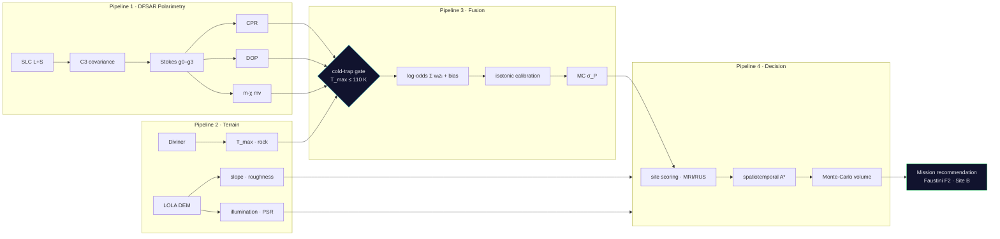

The full run is replayable on `/logs` as 41 timestamped events - from DFSAR ingest and checksum
through calibration, fusion, A\* and Monte-Carlo, to the final recommendation
([`processing_log_data.py`](backend/processing_log_data.py)).

---

## Decision Intelligence Layer

Detection is the **input**. The Decision Layer is where AMRIT becomes a planning system. Values
propagate strictly downward - each derived from the layer above, never typed independently.

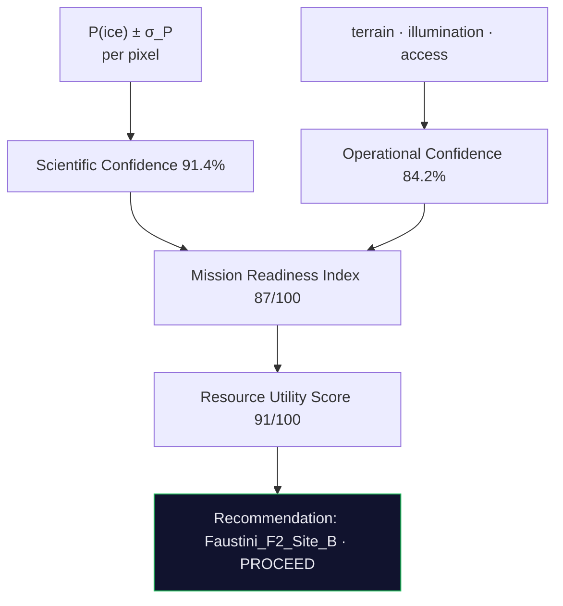

### Mission Readiness Index (MRI) - *"can we execute a mission here?"*

A weighted composite of five normalized site properties
([`compute_mri()`](backend/run_all.py), [`MRIDrilldownModal.tsx`](frontend/src/components/modals/MRIDrilldownModal.tsx)):

```
MRI = 100 · ( 0.30·IceConfidence + 0.25·TerrainSafety + 0.20·Illumination
            + 0.15·Accessibility + 0.10·PredictionCertainty )
```

For Site B: `0.910·0.30 + 0.882·0.25 + 0.820·0.20 + 0.793·0.15 + 0.940·0.10 = 0.870 → 87`.
Site A has higher peak ice (0.96) but a 22° slope collapses its terrain score to 0.41 → **MRI 69**.
The drill-down modal lets you re-weight the five components live; weights always renormalize to 1.0
and the score recomputes, while the underlying physics (P(ice), traverse, volume) stays fixed.

### Resource Utility Score (RUS) - *"is this resource worth the mission time?"*

```
RUS = 100 · ( 0.30·IceLikelihood + 0.25·Accessibility + 0.20·ExcavationEase
            + 0.15·ScientificImportance + 0.10·OperationalSafety )
```

MRI and RUS are different questions. A site can be easy to reach but ice-poor (high MRI, low RUS) or
ice-rich but marginal terrain (high RUS, low MRI). **The recommended site is Pareto-optimal on both.**

### Scientific vs Operational Confidence

Two orthogonal axes - the platform never collapses them into one number.

- **Scientific** (additive evidence logits): *is the ice signature genuine, not a roughness artifact?*
  CPR (+24.2), DOP (+22.1), thermal (+21.8), rock (+14.3), L/S agreement (+9.0) → **91.4%**.
  This is **not** "the probability ice exists" - it is the probability the multi-line evidence is
  consistent with ice and inconsistent with the Fa & Eke roughness alternative.
- **Operational** (multiplicative risk): *can the mission physically execute?*
  `Π (1 − riskᵢ)` over slope, shadow, boulder, SoC margin, and access → **84.2%**.

A decision matrix turns the pair into an action:

| | Op ≥ 80% | Op < 80% |
|---|---|---|
| **Sci ≥ 80%** | **PROCEED** | science-ready, op review |
| **Sci < 80%** | op-ready, more science | do not proceed |

Faustini F2 Site B: **Sci 91.4% · Op 84.2% → PROCEED.**

---

## Algorithms

### Bayesian log-odds evidence fusion

The core of the platform ([`lrip_core.py`](backend/lrip_core.py) `_logit_terms`, `_fuse`).
Each evidence stream is standardized to a logit contribution, weighted by a physics-seeded prior,
hard-gated by the cold-trap thermodynamics, then calibrated.

```
zᵢ        = standardized evidence (CPR, DOP, mv, thermal, rock, L/S)
logit(x)  = bias + Σ wᵢ·zᵢ              bias = −1.5
            w = {cpr:0.30, dop:0.30, mv:0.20, thermal:0.15, ls:0.05}
gate(x)   = 1 if T_max(x) ≤ 110 K else 0        # cold-trap thermodynamics
P_raw(x)  = gate(x) · σ(logit(x))               # σ = logistic sigmoid
P(ice|x)  = isotonic_calibrate(P_raw(x))        # monotonic, ECE 0.241 → 0.031
```

- **Why log-odds, not deep learning.** There is one direct ground-truth point for lunar ice (LCROSS)
  and four crater-scale detections (PRL 2026) - nothing to train a pixel-level network on. The
  log-odds model is **explainable at every pixel**: the Evidence Inspector reads back exactly which
  streams drove any cell's score. A black box cannot, and reviewers would rightly reject it.
- **Complexity** `O(N)` in pixels; **inputs** six rasters; **output** `P(ice)`, `σ_P`, CI rasters.

### Cold-trap thermal gate

The decisive false-positive filter. Any pixel with annual-max temperature above 110 K cannot retain
surface-stable water ice; its likelihood is forced to zero regardless of radar signature. This single
gate drives the largest jump in the ablation (AUC 0.821 → 0.884, FPR 19.8% → 5.1%).

### Monte-Carlo uncertainty & volume

```
σ_P     = f(∇P)                       # uncertainty peaks at the cold-trap boundary
A_eff   = Σ_x [P(ice,x) > 0.5] · P(ice,x) · 25 m²       # probability-weighted area
φ       ~ wt% · ρ_regolith / ρ_ice,   wt% ~ N(5.6, 2.9)  # LCROSS anchor
depth   ~ Triangular(0.5, 1.8, 4.5) m
model   ~ {MG:0.35, LLL:0.40, Bruggeman:0.25}            # mixing-model non-uniqueness
V       = A_eff · depth · φ · model · pore_fill          # N = 50,000 draws
```

Output: median **≈ 7,900 m³**, 5–95% posterior, and a variance budget dominated (45%) by mixing-model
non-uniqueness - the exact reason PRL 2026 omits volume. ([`volume()`](backend/run_all.py)).

### Spatiotemporal A\* with ice-confidence reward

```
cost(x) = w_slope·slope(x) + w_shadow·shadow(x) + w_boulder·boulder(x) − w_ice·P(ice,x)
```

The `−w_ice·P(ice)` term is the coupling no published planner has: high-likelihood cells become
*cheaper*, bending the optimal path toward ice. Setting `w_ice = 0` recovers the terrain-only route.
A state-of-charge model drains the battery with distance and recharges only under illumination,
enforcing a 15% floor. ([`astar()`, `evaluate_path()`](backend/run_all.py)).

### MRI / RUS multi-criteria scoring · dual confidence

Weighted linear scores over normalized criteria (see [Decision Layer](#decision-intelligence-layer)),
with multiplicative operational risk and additive scientific evidence logits.

### Matplotlib-faithful colormaps & marching-squares contours (frontend)

[`colormap.ts`](frontend/src/lib/colormap.ts) implements `plasma`, `hot`, `viridis_r`, `magma`,
`YlOrRd`, and `greens` as RGB anchor LUTs with linear interpolation, plus an RGB compositor for the
m-χ view. [`HeatmapLayer.tsx`](frontend/src/components/science/HeatmapLayer.tsx) renders 220×220
float rasters to canvas `ImageData` and overlays SVG iso-contours via a memoized cell-crossing scan
- `O(W·H)` per level, recomputed only when the field or level changes.

---

## Visual gallery

| | |
|---|---|
|  |  |
| **Naive vs calibrated** - the false-positive collapse | **P(ice) field** - contours + peak marker |
|  |  |
| **Polarimetric stack** - CPR · DOP · mv · σ_P | **m-χ RGB** - volumetric scattering = green |
|  |  |
| **Terrain layers** - elevation · slope · illum · T_max | **Traverse ablation** - detection bends the path |
|  |  |
| **Battery model** - SoC never below 15% | **Volume posterior** - LCROSS-anchored MC |
|  |  |
| **ROC + calibration** - AUC & ECE | **Ablation** - per-layer AUC↑ / FPR↓ |
|  |  |
| **MRI/RUS + Pareto front** | **Uncertainty budget** |

---

## Technology stack

| Layer | Technology |
|---|---|
| **Frontend framework** | React 18 · TypeScript 5.6 |
| **Build / tooling** | Vite 5 · npm workspaces |
| **Styling** | Tailwind CSS 3.4 · CSS custom-property design tokens |
| **Routing** | React Router v6 (data router) |
| **State** | React Context (`PanelContext`) + local `useState` |
| **Charts** | Recharts (ROC, calibration, battery, histogram, Pareto) |
| **Raster rendering** | HTML5 Canvas + custom matplotlib-faithful colormap LUTs |
| **Icons / type** | Lucide React · Inter (UI) · JetBrains Mono (all data) |
| **Data pipelines** | Python 3.12 · NumPy |
| **Figures / docs** | Matplotlib (renders README figures from the real JSON) |
| **Container** | Docker (`frontend/Dockerfile`) |

---

## Installation

Prerequisites: **Node 18+** and **Python 3.12**. On Windows, the `py` launcher is used for Python.

```bash
git clone https://github.com/mridulbansal4/Amrit.git
cd Amrit            # project root
```

**Windows (PowerShell)**

```powershell
npm install
pip install -r backend/requirements.txt    # numpy
npm run pipelines                           # py -3.12 backend/run_all.py
npm run dev                                 # http://localhost:5173
```

**Linux / macOS**

```bash
npm install
python3 -m pip install -r backend/requirements.txt
python3 backend/run_all.py                  # regenerate frontend/src/data/generated/*.json
npm run dev
```

**Docker**

```bash
docker build -t lrip ./frontend
docker run -p 5173:5173 lrip                # serves the production build on :5173
```

> The generated data is already committed under `frontend/src/data/generated/`, so for a quick start
> you can skip the pipeline step: `npm install && npm run dev`.

---

## Running

| Command (from project root) | Purpose |
|---|---|
| `npm install` | Install frontend deps (npm workspace) |
| `npm run dev` | Vite dev server on `:5173` |
| `npm run build` | Type-check (`tsc -b`) + production build → `frontend/dist` |
| `npm run preview` | Serve the production build |
| `npm run pipelines` | Regenerate all data via the Python backend (`seed=42`) |
| `py -3.12 docs/generate_figures.py` | Re-render every README figure from the JSON |

`npm run dev` runs from the root - the workspace forwards it to `frontend/`. To work in the app
directly: `cd frontend && npm run dev`.

---

## API contract

At runtime AMRIT makes **no network calls** - all data is imported (PRD Rule 1). The platform is
nonetheless designed against a forward-looking REST contract, surfaced in **Developer Mode** (`/dev`,
[`DeveloperMode.tsx`](frontend/src/pages/DeveloperMode.tsx)). Each static import maps 1:1 to a future
endpoint:

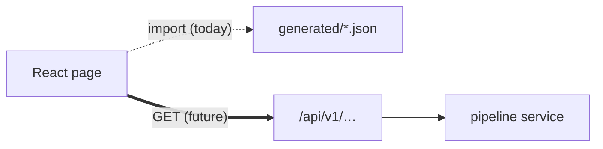

| Endpoint | Returns |
|---|---|
| `GET /api/v1/missions/{id}` | `Mission` object - identity, status, headline scores |
| `GET /api/v1/likelihood/{id}/raster` | GeoTIFF float32 `P(ice)`, south-polar stereographic |
| `GET /api/v1/decision/{id}` | `Decision` - sites, MRI/RUS components, dual confidence |
| `GET /api/v1/traverse/{id}` | `TraversePlan` - AMRIT + naive paths, ablation, SoC |
| `GET /api/v1/volume/{id}` | `VolumeEstimation` - posterior, mixing models, budget |
| `GET /api/v1/validation/{id}` | ROC, calibration, ablation, cross-sensor |

Type definitions for every payload live in [`frontend/src/data/types.ts`](frontend/src/data/types.ts).

---

## Feature matrix

| Capability | Traditional detection workflow | **AMRIT** |
|---|---|---|
| Ice signature | CPR/DOP binary mask | calibrated `P(ice) ∈ [0,1]` with σ and CI |
| Roughness false positives | unaddressed | thermal gate + rock + DOP + L/S fusion |
| Uncertainty | none | propagated end-to-end |
| Landing site | manual | MRI ranking + Pareto |
| Resource economics | none | Resource Utility Score |
| Rover path | none | power-aware A\* with ice reward |
| Battery feasibility | none | SoC model, 15% floor |
| Volume | none | 50k-sample Monte-Carlo posterior |
| Confidence | single flag | Scientific × Operational matrix |
| Explainability | - | per-pixel evidence audit |
| Auditability | - | 41-event replayable processing log |

---

## Performance

- **Build:** `tsc -b && vite build` in ~8–10 s; bundle ~1.6 MB (~336 KB gzip).
- **Raster rendering:** 220×220 (48,400-px) fields drawn to canvas `ImageData` in a single pass;
  iso-contour scans are memoized so cursor hover never recomputes them.
- **Load feel:** every page runs an 800 ms simulated pipeline-load then a 200 ms fade - deliberate,
  communicating computation rather than a file read.
- **Determinism:** the entire dataset is reproducible from `seed=42`; same seed → identical output.
- **Offline-first:** no runtime network dependency beyond the web-font stylesheet.

---

## UI design philosophy & design system

The interface reads as **operational precision** - Bloomberg Terminal information density, NASA
mission-control status bars, Palantir-style evidence panels. Dark, high-contrast, monochrome with a
single accent. Every number is monospace and carries its uncertainty; the word "confirmed" never
appears next to "ice."

Design tokens live in [`tailwind.config.ts`](frontend/tailwind.config.ts) and
[`index.css`](frontend/src/index.css):

| Token group | Values |
|---|---|
| **Surfaces** | `#0a0a0f` · `#0f0f1a` · `#141422` · `#1a1a2e` |
| **Accent** | `#3b5bdb` → `#4c6ef5` |
| **Confidence** | high `#22c55e` · mod `#f59e0b` · low `#f97316` · critical `#ef4444` |
| **Visualization** | CPR `#ff6b35` · DOP `#4ecdc4` · P(ice) `#cc66ff` · AMRIT path `#00e5ff` · naive `#ff7043` · volume `#3366ff` |
| **Type** | Inter (UI) · JetBrains Mono (all data values) |
| **Radius / elevation** | 3 / 6 / 8 / 12 px · four shadow tiers |

A consistent confidence colour language ([`formatting.ts`](frontend/src/lib/formatting.ts)
`confidenceTier`) maps every score to high/moderate/low/critical across gauges, badges, and tables.

---

## Data flow

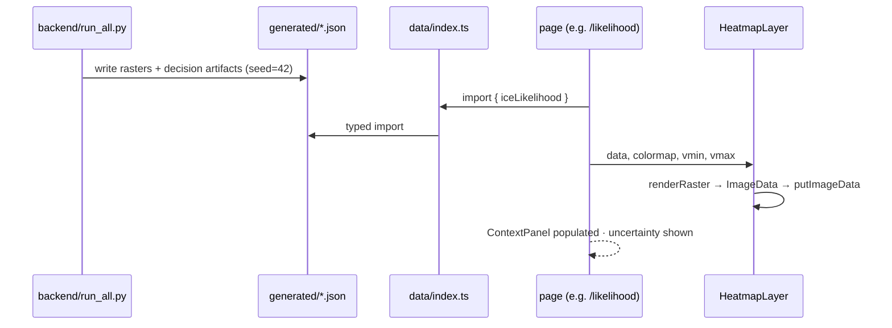

## State management

Deliberately minimal - no Redux. React Router v6 owns navigation
([`router.tsx`](frontend/src/router.tsx)); a small React Context
([`PanelContext.tsx`](frontend/src/components/layout/PanelContext.tsx)) lets each page populate the
right context panel without prop-drilling, falling back to the mission summary so the panel is never
empty; everything else is local component `useState` (evidence toggles, modal open state, layer
selection). The data layer is immutable, imported once.

---

## Future roadmap

- **Phase 1 - live ingest.** Connect the pipelines to real DFSAR via the ISDA API; replace the
  synodic illumination approximation with SPICE; GeoTIFF rasters in place of bundled arrays.
- **Phase 2 - autonomy.** D\* Lite replanning on hazard discovery; full TOPSIS multi-criteria
  ranking; multi-mission support beyond Faustini F2.
- **Phase 3 - research.** Semi-supervised likelihood refinement as new craters are labelled;
  tomographic depth profiling from multi-pass DFSAR; ShadowCam boulder fusion.

---

## Acknowledgements

- **PRL Ahmedabad** - Sinha, Bharti et al. (2026), the detection result AMRIT extends.
- **NASA LRO** - LOLA (topography) and Diviner (thermal) instrument teams.
- **LCROSS** - Colaprete et al. (2010), the direct ground-truth anchor for the volume posterior.
- **ISRO / ISSDC** - Chandrayaan-2 DFSAR and the Bharatiya Antariksh Hackathon 2026.

---

## Citation

```bibtex
@software{amrit2026,
  title  = {AMRIT: Lunar Resource Intelligence Platform},
  author = {AMRIT Team},
  year   = {2026},
  note   = {Bharatiya Antariksh Hackathon 2026, Problem Statement 8},
  url    = {https://github.com/mridulbansal4/Amrit}
}
```

**Key references.** Sinha, Bharti et al. (2026), *npj Space Exploration*, DOI
`10.1038/s44453-026-00038-9` · Colaprete et al. (2010), *Science*, DOI `10.1126/science.1186986`.

---

## License

Released under the [MIT License](LICENSE).

<div align="center">
<br/>
<sub><b>AMRIT</b> - Lunar Resource Intelligence Platform · Detection → Decision → Traverse → Confidence</sub>
</div>
